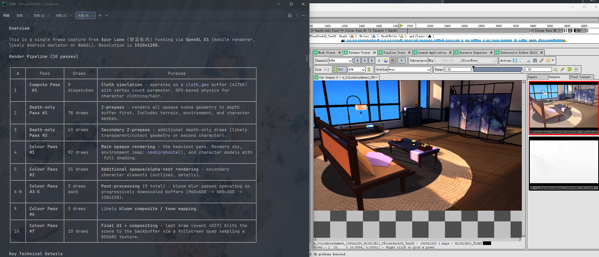
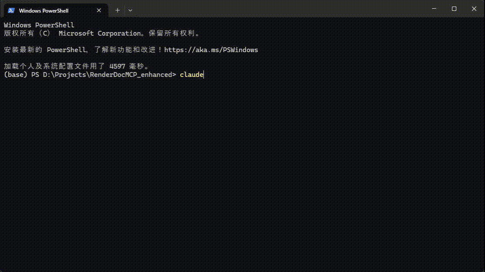
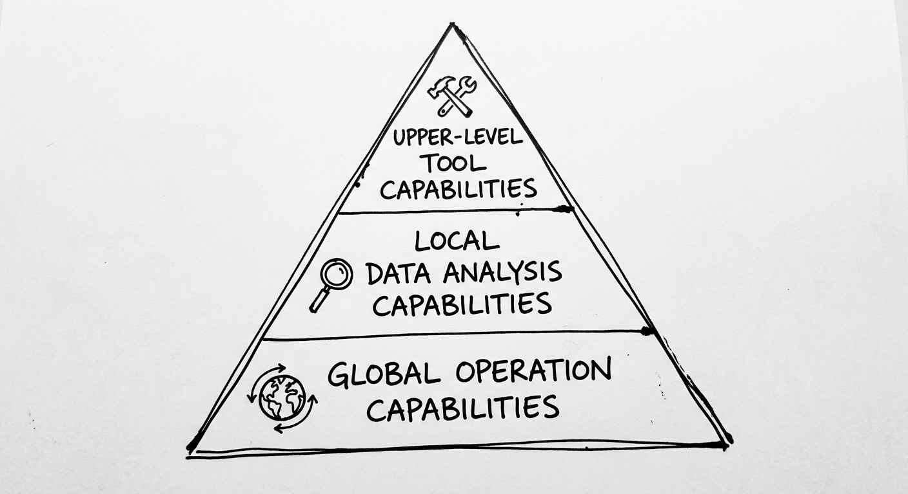

# RenderDoc MCP Server Enhanced

[English](README.md) | [日本語](README_ja.md) | [中文](README_zh.md)

> This is a fork of [RenderDocMCP](https://github.com/halby24/RenderDocMCP), focusing on cross-API compatibility (especially OpenGL scenes) and MCP tool interface design improvements.

RenderDoc MCP Enhanced enables AI assistants to perform more efficient graphics debugging, rendering analysis, and optimization suggestions based on RenderDoc capture data.



## Architecture

This project uses a process-separation architecture based on FastMCP 2.0.

`uv` registers the global command `renderdoc-mcp`. When AI clients (like Claude) detect this MCP command, they will start the MCP Server.

The MCP Server communicates with the AI client via stdio, and forwards requests to the extension running in RenderDoc's built-in Python 3.6 environment via file-based IPC.

```
  Claude/AI Client
      │  (stdio, JSON-RPC via FastMCP)
      ▼
  mcp_server/server.py          ← @mcp.tool definitions
      │  bridge.call("method", params)
      ▼
  mcp_server/bridge/client.py   ← writes %TEMP%/renderdoc_mcp/request.json
      │  (file-based IPC, polls response.json)
      ▼
  renderdoc_extension/socket_server.py  ← reads request.json, dispatches to RequestHandler
      │
      ▼
  request_handler.py            ← method → _handle_xxx() → facade.xxx()
      │
      ▼
  renderdoc_facade.py           ← thin proxy layer, dispatches to services
      │
      ▼
  services/*.py                 ← operates RenderDoc ReplayController API
      │  controller.BlockInvoke(callback)  ← all API calls must run on replay thread
      ▼
  RenderDoc Core
```

Since the built-in Python in RenderDoc does not have the socket module, file-based IPC is used for communication.

## Setup

### System Requirements

- Python 3.10+
- [uv](https://docs.astral.sh/uv/)
- RenderDoc 1.20+
- Windows

> **Note**: Currently only tested on Windows environment.
> The architecture may theoretically work on Linux, but this has not been tested or adapted yet.

### 1. Install RenderDoc Extension

After cloning this repository, run in the project root:
```bash
python scripts/install_extension.py
```
The extension will be installed to `%APPDATA%\qrenderdoc\extensions\renderdoc_mcp_bridge`.

### 2. Enable Extension in RenderDoc

1. Launch RenderDoc
2. Tools > Manage Extensions
3. Enable "RenderDoc MCP Bridge"

### 3. Install MCP Server

Run in the project root:
```bash
uv tool install . # Install from current directory
uv tool update-shell  # Add renderdoc-mcp command to PATH
```

After restarting your shell, the `renderdoc-mcp` command will be available.

> **Note**: Use `--editable` to reflect source code changes immediately (useful for development).
> For a stable installation, use `uv tool install .`.

### 4. Configure MCP Client

You can open Claude Code directly in this project directory. Claude Code will automatically detect `.mcp.json` and register the MCP server for the current session.

Using project-level configuration is generally recommended to avoid global MCP settings affecting other workspace contexts.



#### Claude Desktop (global configuration)

Add to `claude_desktop_config.json`:

```json
{
  "mcpServers": {
    "renderdoc": {
      "command": "renderdoc-mcp"
    }
  }
}
```

#### Claude Code / Other MCP-compatible clients (global configuration)

Add to `.mcp.json`:

```json
{
  "mcpServers": {
    "renderdoc": {
      "command": "renderdoc-mcp"
    }
  }
}
```

## Usage

1. Launch RenderDoc and open a capture file (.rdc)
2. Access RenderDoc data from your MCP client (Claude, etc.)

## Design Philosophy

This project focuses on optimizing the MCP tool interface organization, naming consistency, and calling experience on top of the original implementation.

The goal is to cover higher-frequency RenderDoc analysis needs with fewer, more stable, and more composable interfaces, making it easier for AI to perform chained calls.

#### Canonicalization

Similar capabilities are consolidated into a unified entry point rather than being split into multiple semantically similar MCP commands.

For example, multiple draw search interfaces are merged into `search_draws`, resource enumeration is unified as `list_resources`, and specific types and query dimensions are distinguished through parameters.

#### Shape Consistency

Different tools should follow consistent parameter styles and return structures rather than each defining its own format.

For example, paginated results uniformly use `items / total_count / offset / limit`, and search results uniformly use `matches / total_matches / scanned_count`.

#### Progressive Disclosure

The entire MCP toolset is organized into three capability tiers:

- **Global Operations**: Navigation, targeting, and global summaries for capture / frame / resource space — answering "what should I look at, how big is the scope, where do I start".
- **Local Data Analysis**: Deep analysis of specific events, shaders, textures, buffers, and meshes — answering "what happened at this specific point".
- **Upper-level Tools**: Export, save, and downstream workflow capabilities — answering "how do I reuse this, I want to see the resource".



## MCP Tools

### Global Operations

#### Capture Management

- `open_capture` - Open a capture file directly from the MCP client
- `list_captures` - List `.rdc` files in a directory
- `get_capture_status` - Check capture loading status

#### Frame Overview

- `get_frame_summary` - Get frame-wide statistics and top-level marker summaries
- `summarize_capture` - Builds on `get_frame_summary` with additional full-frame GPU timing, sorting, and deduplication; returns a high-level overview with suggested investigation entry points

#### Action Navigation

- `get_draw_calls` - Get draw call / action hierarchy with filtering
- `search_draws` - Unified search for draw calls by shader, texture, or resource

#### Resource Space Browsing

- `list_resources` - List textures or buffers with one paginated interface

### Local Data Analysis

#### Pipeline State

- `get_pipeline_state` - Get full pipeline state with concise input/output texture summaries
- `get_shader_info` - Get shader disassembly, constant buffers, and bindings
- `get_shader_source` - Get original shader source text when RenderDoc preserves text-backed source

#### Resource Data Access

- `get_texture_info` - Get texture metadata
- `get_texture_data` - Get texture pixel data (Base64)
- `get_buffer_contents` - Get buffer contents (Base64)
- `get_mesh_summary` - Get mesh topology, counts, attributes, and bounds
- `get_mesh_data` - Get paginated mesh data

#### Action Metadata

- `get_draw_call_details` - Get detailed information about a specific draw call
- `get_action_timings` - Get GPU timings for actions

#### Composite Analysis

Cross-dimensional queries that orchestrate multiple services on top of atomic tools, providing a quick global view.

- `inspect_event` - Inspect one event with compact details, timing, shader summaries, pipeline summaries, and mesh summary
- `trace_resource_usage` - Trace where a resource is read, written, and consumed across matching events
- `trace_event_dependencies` - Trace the immediate resource dependencies and likely producer events of one event
- `diff_events` - Compare two events and highlight meaningful state differences
- `analyze_pass` - Summarize one marker subtree or pass as a coherent workload

### Upper-level Tools

#### Resource Export

- `save_texture` - Save texture to image file (PNG/JPG/BMP/TGA/EXR/DDS/HDR)
- `export_mesh_csv` - Export mesh CSV for downstream workflows

## Examples

For detailed usage examples, see [MCP Tools Reference](docs/tools.md).

## TODO

The current version focuses on tool interface simplification, interface canonicalization, cross-API compatibility enhancements, and extension adaptation under RenderDoc's Python 3.6 environment.

Future work will continue to clean up compatibility layer tools based on testing results, and gradually add higher-level analysis capabilities (current plan is to build upper-level tools for model assembly). Adding hot-reload module.

## License

MIT
